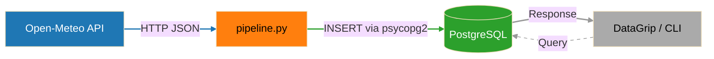

# API to PostgreSQL ETL Pipeline

## Overview

This project implements a basic ETL (Extract → Transform → Load) pipeline that:

- Extracts real-time weather data from the Open-Meteo API
- Transforms and normalizes the data (including unit conversions)
- Loads the data into a PostgreSQL database

This project demonstrates foundational data engineering concepts such as:

- API ingestion
- Data transformation
- Database schema design
- Idempotent data loading
- Environment-based configuration

## Key Concepts Practiced

- API integration (HTTP GET requests to an external weather API)
- Data normalization (transforming raw API responses into structured records)
- Database persistence (storing normalized data in PostgreSQL)
- Dockerized databases (running PostgreSQL in a containerized environment)
- Transaction handling (understanding commits, rollbacks, and ACID principles)
- Error handling (implementing fail-safe exception handling)
- Retry and timeout handling (improving API resilience)
- Unit testing (validating transformation, extraction, configuration, and orchestration logic)
- CI/CD validation (running static analysis and unit tests with GitHub Actions)
- Environment configuration (externalizing application settings using `.env` variables)
- Operational troubleshooting (diagnosing runtime, database, CI/CD, and environment issues)

## Tech Stack

- Python
- requests (HTTP client)
- psycopg2 (PostgreSQL adapter)
- PostgreSQL (database)
- Docker (local DB container)
- DataGrip (query tool)
- python-dotenv (configuration management)

## Architecture



## CI/CD Workflow

This repository uses GitHub Actions to automatically validate code changes during development.

Current workflow capabilities include:

Developer Push
    ↓
GitHub Actions Workflow Triggered
    ↓
Python Environment Provisioned
    ↓
Project Dependencies Installed
    ↓
Pylint Static Analysis Executed
    ↓
Pytest Unit Tests Executed
    ↓
Branch Protection Quality Gates Applied

## Testing

This project uses `pytest` to validate pipeline behavior without requiring live API calls or database connections.

Current test coverage includes:

- Transform logic validation
- Unit conversion checks
- Environment configuration behavior
- API timeout and retry behavior
- Pipeline orchestration flow

Tests can be run locally with:

```bash
pytest
```

Static analysis can be run with:

```bash
pylint src tests utils
```

### Workflow Overview

```text
Developer Push
    ↓
GitHub Actions Workflow Triggered
    ↓
Python Environment Provisioned
    ↓
Project Dependencies Installed
    ↓
Static Analysis Executed
    ↓
Branch Protection Quality Gates Applied
```

## Quick Start

1. Activate virtual environment

    ```bash
    source .venv/bin/activate
    ```

2. Start PostgeSQL

    ```bash
    docker start pipeline_postgres
    ```

3. Run Schema

    ```bash
    psql -h localhost -p 5433 -U pipeline_user -d pipeline_db -f sql/schema.sql
    ```

4. Run pipeline

    ```bash
    python3 src/pipeline.py
    ```

## Docker Compose Runtime

Phase 3 adds a containerized runtime using Docker Compose.

The Compose stack includes:

- PostgreSQL database container
- ETL application container
- Shared Docker network
- Persistent PostgreSQL volume
- Automatic schema initialization
- PostgreSQL healthcheck before ETL startup

Run the full stack:

```bash
docker compose up --build
```

## Example Queries

See [queries](sql/queries.sql) for:

- Latest observations
- Location filtering
- Time-based quries
- Aggregations
- Data validation queries

## Documentation

- [Architecture](docs/architecture.md)
- [Setup Guide](docs/setup.md)
- [Data Model](docs/data-model.md)
- [Troubleshooting](docs/troubleshooting.md)
- [Retrospective](docs/phase-1-retrospective.md)

## Example Output

```bash
Pipeline complete. Location: Augusta, GA | Temp: 22.6C / 72.7F | Wind: 15.2 km/h / 9.4 mph | Observed: 2026-04-23 23:00:00
```

## Project Status

### Phase 1 — Foundational ETL Pipeline ✅

Phase 1 established the core ETL workflow and foundational data engineering concepts.

Completed capabilities:

- Open-Meteo API ingestion
- Data normalization and transformation
- PostgreSQL persistence
- Dockerized PostgreSQL runtime
- Environment-based configuration
- SQL schema design
- Operational troubleshooting basics

### Phase 2 — Reliability and Testing Enhancements ✅

Phase 2 focused on improving operational maturity, resiliency, testing, and CI/CD validation.

Completed capabilities:

- Retry and timeout handling
- Structured logging
- pytest-based unit testing
- Negative-path testing
- GitHub Actions CI validation
- Pipeline orchestration tests
- Reusable test fixtures
- Expanded troubleshooting documentation
- `pyproject.toml` centralized tooling configuration

### Phase 3 — Containerized Runtime and Orchestration ✅

Phase 3 transitioned the project into a portable multi-service runtime using Docker and Docker Compose.

Completed capabilities:

- Dockerized ETL application runtime
- Docker Compose orchestration
- PostgreSQL healthchecks and startup readiness
- Persistent PostgreSQL volumes
- Automatic schema initialization
- Container networking and runtime configuration
- `.env` and `.env.example` externalized configuration strategy
- Makefile developer workflow automation
- Non-root container execution

### Current State

The project now supports:

- Local Python execution
- Dockerized PostgreSQL execution
- Fully containerized ETL runtime using Docker Compose
- Automated testing and CI/CD validation
- Operational troubleshooting and runtime diagnostics

### Next Phase

Phase 4 will focus on deployment and platform engineering concepts, including:

- Kubernetes fundamentals
- Helm-based deployment packaging
- ConfigMaps and Secrets
- Kubernetes Jobs for ETL execution
- Health probes and readiness checks
- Platform-level observability and diagnostics
