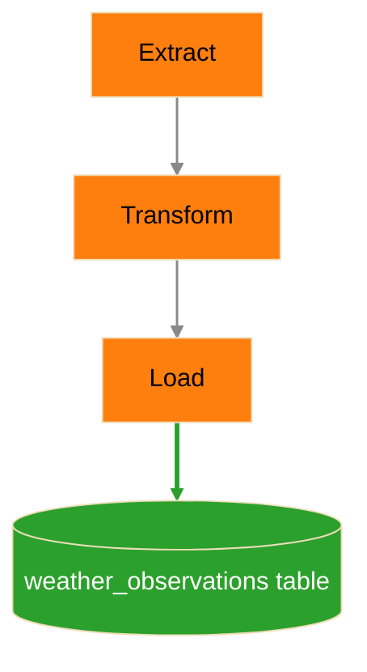
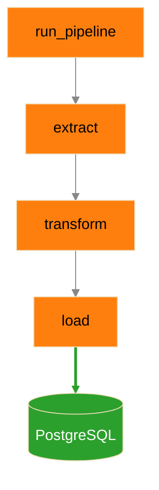
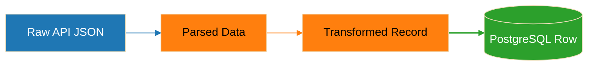
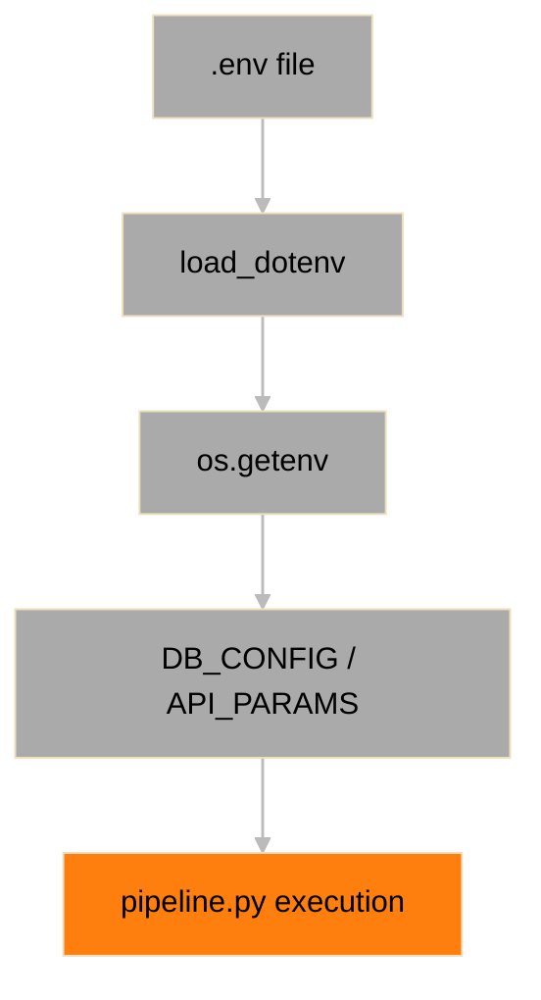
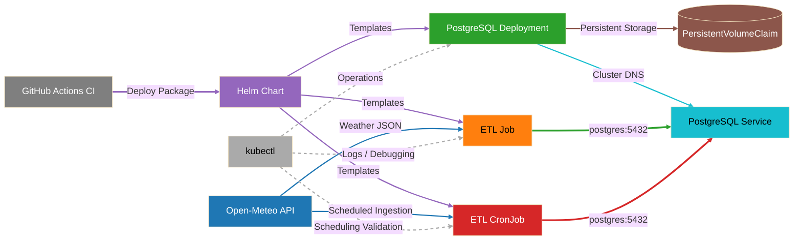

# Architecture

## Overview

This project implements a simple, end-to-end ETL (Extract → Transform → Load) pipeline that ingests weather data from an external API and stores it in a PostgreSQL database.

The system is designed to demonstrate:

- Data ingestion from an external service
- Data transformation and normalization
- Persistent storage in a relational database
- Query-based data retrieval

## System Context

## Description

- **Open-Meteo API**: External data source providing weather data
- **pipeline.py**: Core application responsible for ETL logic
- **PostgreSQL**: Persistent storage layer
- **DataGrip**: Tool used for querying and validating stored data

## ETL Flow

## ETL Flow Description

1. Extract
    - Sends HTTP request to Open-Meteo API
    - Retrieves JSON payload
2. Transform
    - Extracts relevant fields
    - Converts units:
      - Celsius → Fahrenheit
      - km/h → mph
    - Normalizes data structure
3. Load
    - Inserts record into PostgreSQL
    - Uses ON CONFLICT to prevent duplicates

## Execution Flow

## Execution Flow Description

- `run_pipeline()` orchestrates execution
- Each function represents a distinct pipeline stage
- Data flows sequentially through the system

## Data Flow

## Data Flow Description

- Raw API response is parsed into Python structures
- Data is transformed into a normalized record
- Record is inserted into the database

## Configuration Flow

## Configuration Flow Description

- Environment variables define runtime configuration
- Supports default + override pattern:
  - DEFAULT_* → fallback
  - WEATHER_* → runtime override

## Key Design Decisions

1. Environment-Based Configuration
    - Avoids hardcoding values
    - Enables flexible deployment
2. Idempotent Data Loading
    - UNIQUE (location, observed_at)
    - ON CONFLICT DO NOTHING
    - Prevents duplicate records
3. Separation of Concerns
    - Extract, Transform, Load are independent functions
    - Improves readability and maintainability
4. Context Managers for DB Access
    - Uses `with psycopg3.connect()` and `with conn.cursor()`
    - Ensures automatic cleanup of connections and cursors
    - Prevents resource leaks and connection exhaustion

## Kubernetes and Helm Runtime Architecture

## Current Limitations

The platform has significantly evolved beyond the original standalone ETL implementation, but several limitations still exist.

Current limitations include:

- Single-region PostgreSQL deployment
- Single-node Kubernetes validation only
- No centralized logging stack
- No Prometheus metrics integration
- No Grafana dashboards
- No distributed tracing
- No connection pooling
- No horizontal scaling strategy for PostgreSQL
- No production ingress controller
- Local container registry dependency for Kubernetes image distribution
- Limited retry/backoff tuning for external API failures
- No advanced workload autoscaling
- No high-availability PostgreSQL configuration
- No centralized secret management solution
- No production-grade backup and disaster recovery workflows

## Possible Future Enhancements

### Data and Pipeline Enhancements

- Multi-location ingestion support
- Historical weather ingestion workflows
- Batch ingestion pipelines
- Incremental ingestion optimization
- Data retention and archival policies
- Data partitioning strategies for scale

### Platform and Kubernetes Enhancements

- Horizontal workload scaling
- Production-grade ingress controller support
- Kubernetes autoscaling
- Multi-environment deployment promotion workflows
- External container registry integration
- High-availability PostgreSQL deployment
- Advanced Helm deployment validation

### Observability and Monitoring Enhancements

- Prometheus metrics integration
- Grafana dashboard visualization
- OpenTelemetry instrumentation
- Distributed tracing
- Structured JSON logging
- Centralized log aggregation
- Alerting and operational diagnostics

### Application and API Enhancements

- REST API for querying weather data
- Authentication and authorization
- API rate limiting
- Query filtering and aggregation endpoints
- Swagger/OpenAPI documentation
- Background worker orchestration

### Operational and DevOps Enhancements

- Automated backup and restore workflows
- Disaster recovery procedures
- GitOps deployment workflows
- Advanced CI/CD deployment pipelines
- Security scanning and policy enforcement
- Infrastructure-as-Code integration
