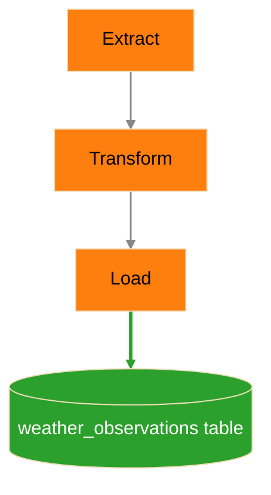
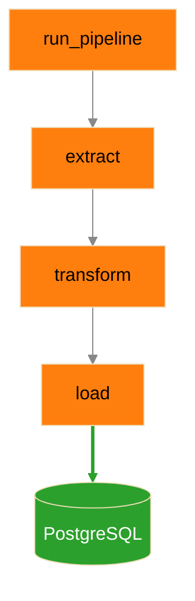
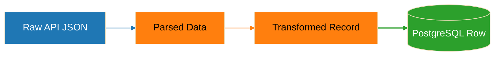
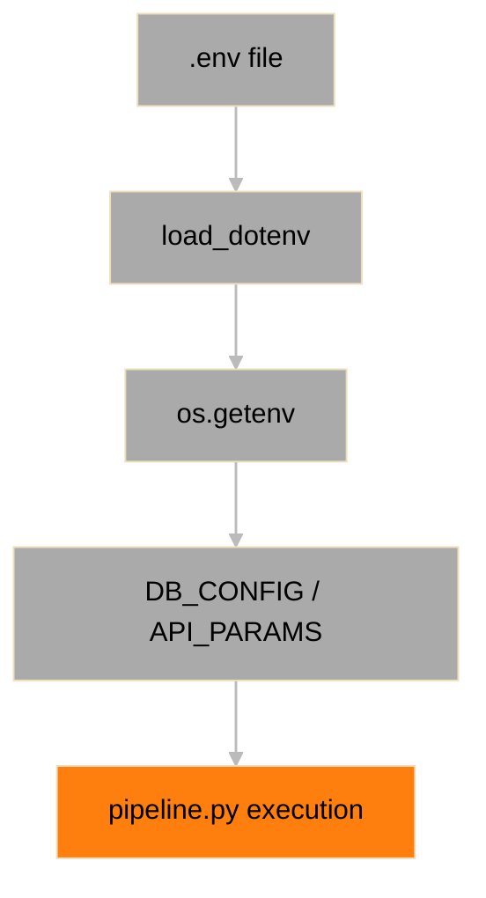

# Architecture

## Overview

This project implements a simple, end-to-end ETL (Extract → Transform → Load) pipeline that ingests weather data from an external API and stores it in a PostgreSQL database.

The system is designed to demonstrate:

- Data ingestion from an external service
- Data transformation and normalization
- Persistent storage in a relational database
- Query-based data retrieval

## System Context

## Description

- **Open-Meteo API**: External data source providing weather data
- **pipeline.py**: Core application responsible for ETL logic
- **PostgreSQL**: Persistent storage layer
- **DataGrip**: Tool used for querying and validating stored data

## ETL Flow

## ETL Flow Description

1. Extract
    - Sends HTTP request to Open-Meteo API
    - Retrieves JSON payload
2. Transform
    - Extracts relevant fields
    - Converts units:
      - Celsius → Fahrenheit
      - km/h → mph
    - Normalizes data structure
3. Load
    - Inserts record into PostgreSQL
    - Uses ON CONFLICT to prevent duplicates

## Execution Flow

## Execution Flow Description

- `run_pipeline()` orchestrates execution
- Each function represents a distinct pipeline stage
- Data flows sequentially through the system

## Data Flow

## Data Flow Description

- Raw API response is parsed into Python structures
- Data is transformed into a normalized record
- Record is inserted into the database

## Configuration Flow

## Configuration Flow Description

- Environment variables define runtime configuration
- Supports default + override pattern:
  - DEFAULT_* → fallback
  - WEATHER_* → runtime override

## Key Design Decisions

1. Environment-Based Configuration
    - Avoids hardcoding values
    - Enables flexible deployment
2. Idempotent Data Loading
    - UNIQUE (location, observed_at)
    - ON CONFLICT DO NOTHING
    - Prevents duplicate records
3. Separation of Concerns
    - Extract, Transform, Load are independent functions
    - Improves readability and maintainability
4. Context Managers for DB Access
    - Uses `with psycopg3.connect()` and `with conn.cursor()`
    - Ensures automatic cleanup of connections and cursors
    - Prevents resource leaks and connection exhaustion

## Limitations (Phase 1)

- Single location ingestion
- No retry logic for API failures
- No scheduling or automation
- No structured logging
- No connection pooling

## Future Enhancements (Phase 2+)

- Multi-location ingestion
- Scheduled pipeline execution (cron / scheduler)
- Retry and backoff for API calls
- Structured logging (JSON logs)
- Modular architecture (api, db, config layers)
- API layer for querying data
