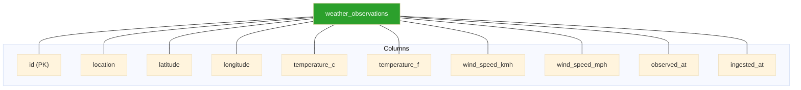

# Data Model

## Overview

The `weather_observations` table stores normalized weather data ingested from the Open-Meteo API.

Each record represents a single observation for a given location at a specific point in time.

This table is designed to support:

- Time-series queries
- Location-based filtering
- Basic analytics and aggregation

---

## Table: weather_observations



## Column Definitions

| Column | Type | Description |
| -------- | -------- | -------- |
| id | SERIAL PRIMARY KEY | Unique identifier for each record |
| location | VARCHAR(100) | Human-readable location (e.g., “Augusta, GA”) |
| latitude | DOUBLE PRECISION | Latitude coordinate |
| longitude | DOUBLE PRECISION | Longitude coordinate |
| temperature_c | DOUBLE PRECISION | Temperature in Celsius |
| temperature_f | DOUBLE PRECISION | Temperature in Fahrenheit |
| wind_speed_kmh | DOUBLE PRECISION | Wind speed in kilometers per hour |
| wind_speed_mph | DOUBLE PRECISION | Wind speed in miles per hour |
| observed_at | TIMESTAMPTZ | Timestamp of the observation (source time) |
| ingested_at | TIMESTAMPTZ | Timestamp when record was inserted |

## Contraints

### Primary Key

```sql
PRIMARY KEY (id)
```

- Ensures each row is uniquely identifiable

### Unique Constraint

```sql
UNIQUE (location, observed_at)
```

- Prevents duplicate observations for the same location and time
- Enable idempotent pipeline behanvior

### Indexes

```sql
CREATE INDEX IF NOT EXISTS idx_weather_location_time
ON weather_observations (location, observed_at DESC);
```

#### Purpose

- Optimizes:
  - Location-based filtering
  - Time-based sorting
- Supports common query pattern:

    ```sql
    SELECT *
    FROM weather_observations
    WHERE location = 'Augusta, GA'
    ORDER BY observed_at DESC;
    ```

## Data Flow (Logical)


## Design Decisions

1. Denormalized Unit Storage
    - Stores both:
        - Celsius and Fahrenheit
        - km/h and mph

    - Why:
        - Avoids repeated computation at query time
        - Improves read performance
        - Simplifies downstream usage (dashboards, APIs)

2. Timezone-Aware Timestamps
    - Uses `TIMESTAMPTZ` for `observed_at`
    - Why:
        - Ensures correct handling across time zones
        - Supports accurate time-based queries

3. Idempotent Data Model
    - Enforced via:

        ```sql
        UNIQUE (location, observed_at)
        ```

    - Why:
        - Prevents duplicate ingestion
        - Supports safe re-runs of pipeleine

4. Simple Schema (Phase 1)
    - Single table design
    - No joins required
    - Why:
        - Keeps system simple for learning and iteration
        - Reduces coplexity during early development

## Example Queries

### Latest Observation

```sql
SELECT
    location,
    temperature_c,
    temperature_f,
    wind_speed_kmh,
    wind_speed_mph,
    observed_at
FROM weather_observations
ORDER BY observed_at DESC
LIMIT 5;
```

### Aggregation

```sql
SELECT
    location,
    AVG(temperature_c) AS avg_temp_c,
    AVG(wind_speed_kmh) AS avg_wind_kmh
FROM weather_observations
GROUP BY location;
```

## Possible Future Enhancements

- Separate locations into a dimention table
- Add historical weather storage (hour/daily)
- Add indexes for time-range queries
- Introduce partitioning for large datasets
- Normalize units into a measurement system
